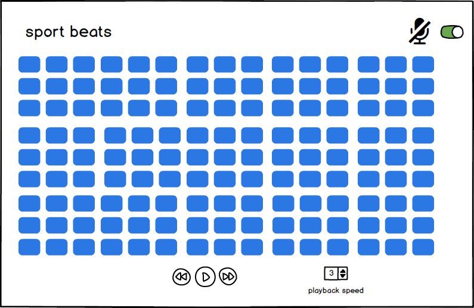

## Sportbeats

### Background

Sportbeats is a beatbox/sound board app created using HTML/CSS, vanilla JavaScript, and jQuery featuring
sport-themed sound effects.

### Functionality & MVP  

With sportbeats, users will be able to:

- [ ] Start, pause, and reset interactive sound board
- [ ] Toggle squares to activate or deactivate sound effects
- [ ] Move a slider to change the pace of play
- [ ] Turn off and on sound through a mute button

In addition, this project will include:

- [ ] A production README

### Wireframes

This app will consist of a single screen with board, controls, and nav links to Github and LinkedIn.  Game controls will include Start, Stop, and mute buttons as well as a slider to control the speed.  

### Architecture and Technologies

**NB**: one of the main things you should be researching and deciding upon while you write this proposal is what technologies you plan to use.  Identify and create a plan of attack for the major technical challenges in your project.  It's okay if you don't have all the details of implementation fleshed out, but you should have a solid roadmap by Monday morning.

This project will be implemented with the following technologies:

- Vanilla JavaScript and `jquery` for overall structure and logic,
- HTML/CSS for rendering and graphics
- Tone.js for managing audio and sound effects
- Webpack to bundle and serve up the various scripts.

In addition to the webpack entry file, there will be two scripts involved in this project:

`board.js`: this script will handle the logic for manipulating the state of cells rendered
`audio.js`: this script will handle the logic audio and sound effects

### Implementation Timeline

**Day 1**: Setup all necessary Node modules, including getting webpack up and running and `tone.js` installed.  Create `webpack.config.js` as well as `package.json`.  Write a basic entry file and the bare bones skeleton of both scripts outlined above.  Learn the basics of `tone.js`.  

**Day 2**: Dedicate this day to learning how to user `tone.js` create and use sounds. First, build out the cell objects to populate to the `Board` object.  Then, use `board.js` to create and render the grid of square cells.  Build in the ability to toggle the live/dead states on click for each cell.  Goals for the day:

- Render a square grid
- Make each cell in the grid clickable, toggling the state of the square on click

**Day 3**: Incorporate controls to start, stop, mute, and change speed of audio. Goals for the day:

- Have a functional basic board interface

**Day 4**: Install remaining controls for the user to interact with the game. Style the frontend, making it polished and professional. Refactor to optimize user experience.

### Bonus features

- [ ] Import sound effects
- [ ] Record and share tracks
